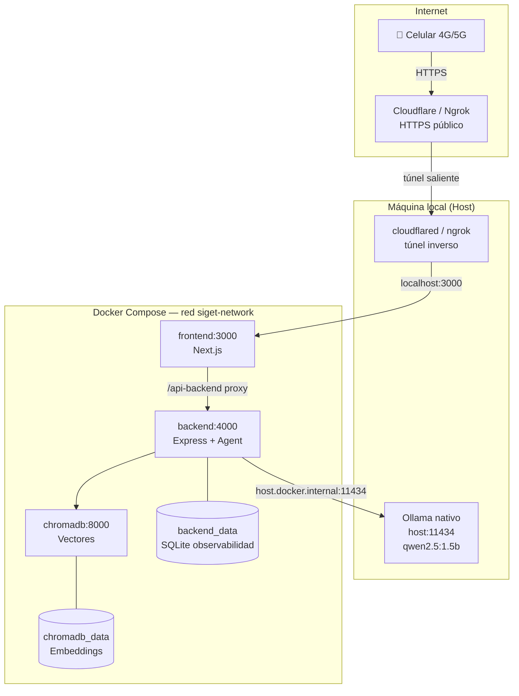

# Entregable Semana 6 — Portabilidad con Docker y Exposición Pública

**Proyecto:** SIGET Peritos — Asistente Inteligente para Peritos de Tránsito  
**Institución:** _[Nombre de la institución]_  
**Curso:** Inteligencia Artificial Local  
**Fecha:** Julio 2026

---

## Integrantes del equipo

| # | Nombre completo | Matrícula / ID |
|---|-----------------|----------------|
| 1 | _[Integrante 1]_ | _[___]_ |
| 2 | _[Integrante 2]_ | _[___]_ |
| 3 | _[Integrante 3]_ | _[___]_ |

---

## 1. Arquitectura de Red y Contenedores

### Diagrama general



### Flujo de una petición externa

1. El celular (red móvil, fuera de WiFi local) accede a la URL pública del túnel.
2. Cloudflare/Ngrok reenvía el tráfico HTTPS al puerto **3000** (frontend).
3. Next.js sirve la UI y enruta `/api-backend/*` al contenedor **backend:4000**.
4. El backend consulta **Ollama** en el host vía `host.docker.internal` y **ChromaDB** en la red interna Docker.
5. Las métricas (TTFT, latencia, IP del cliente) se persisten en **SQLite** (`backend_data`).

### Arquitectura híbrida (opcional — Vercel)

Si el frontend está en Vercel, el túnel apunta al **backend (4000)** y se configura:

- `NEXT_PUBLIC_BACKEND_URL=https://TU-TUNEL.ngrok-free.app` en Vercel
- `CORS_ORIGINS=https://TU-APP.vercel.app` en el backend Docker

---

## 2. Configuración de Orquestación

### docker-compose.yml (raíz del proyecto)

```yaml
services:
  chromadb:          # Base vectorial — volumen chromadb_data
    ports: ['8000:8000']

  backend:           # API del agente — volumen backend_data (SQLite)
    ports: ['4000:4000']
    environment:
      OLLAMA_HOST: host.docker.internal   # Ollama nativo en el host
      DATABASE_PATH: /app/data/siget.db   # Persistencia observabilidad
      CORS_ORIGINS: ${CORS_ORIGINS:-}     # Orígenes permitidos (Vercel)

  frontend:          # Next.js — proxy /api-backend → backend
    ports: ['3000:3000']
    environment:
      BACKEND_URL: http://backend:4000
      NEXT_PUBLIC_BACKEND_URL: /api-backend
```

**Comando único de arranque:**

```bash
docker compose up --build -d
```

### Dockerfile frontend (multi-stage)

| Etapa | Propósito |
|-------|-----------|
| `deps` | Instala dependencias con `npm ci` |
| `builder` | Compila Next.js con `NEXT_PUBLIC_BACKEND_URL` |
| `runner` | Imagen mínima de producción, expone puerto 3000 |

### Dockerfile backend (multi-stage)

| Etapa | Propósito |
|-------|-----------|
| `deps` | Solo dependencias de producción (`npm ci --omit=dev`) |
| `runner` | Código + node_modules, expone puerto 4000 |

### Variables de entorno clave

| Variable | Valor en Docker | Descripción |
|----------|-----------------|-------------|
| `OLLAMA_HOST` | `host.docker.internal` | Puente al LLM en el host |
| `DATABASE_PATH` | `/app/data/siget.db` | SQLite persistente |
| `CORS_ORIGINS` | _(opcional)_ | Dominios del frontend en la nube |
| `NEXT_PUBLIC_BACKEND_URL` | `/api-backend` | Proxy same-origin en contenedor |

---

## 3. Bitácora de Conectividad Externa

> **Instrucción:** Completa esta sección con capturas reales después de ejecutar el túnel.

### 3.1 Túnel activo

**Opción usada:** ☐ Cloudflare Quick Tunnel  ☐ Ngrok  ☐ VPS

**Comando ejecutado:**

```powershell
# Cloudflare (recomendado, sin registro)
.\scripts\tunnel-cloudflare.ps1

# O Ngrok
.\scripts\tunnel-ngrok.ps1
```

**URL pública obtenida:** `https://_____________________.trycloudflare.com`

**Captura 1 — Túnel activo en terminal:**  
_[Insertar captura de pantalla aquí]_

**Captura 2 — App funcionando en celular con datos móviles (4G/5G):**  
_[Insertar captura de pantalla aquí]_

### 3.2 Observabilidad — peticiones desde red externa

Consultar métricas después de probar desde el celular:

```bash
node scripts/query-observability.js --url http://localhost:4000
```

**Captura 3 — Métricas con IP externa registrada:**  
_[Insertar captura de pantalla aquí]_

Ejemplo de salida esperada:

```
ID  | TTFT(ms) | Latencia(ms) | IP Cliente        | Prompt (preview)
----|----------|--------------|-------------------|------------------
12  |     1240 |         4820 | 201.xxx.xxx.xxx   | Que dice el reglamento...
```

**Captura 4 — Logs Docker en tiempo real durante interacción externa:**

```bash
docker compose logs -f backend frontend
```

_[Insertar captura de pantalla aquí]_

---

## 4. Análisis Comparativo de Latencia

### Metodología

- **Pregunta de prueba:** _"Resume en una oración qué es un dictamen de tránsito."_
- **Corridas por escenario:** 5
- **Herramienta:** `node scripts/benchmark-latency.js`

### Comandos de medición

```bash
# Escenario LOCAL (Docker en localhost)
node scripts/benchmark-latency.js --url http://localhost:3000/api-backend --runs 5

# Escenario PÚBLICO (URL del túnel)
node scripts/benchmark-latency.js --url https://TU-TUNEL.trycloudflare.com/api-backend --runs 5
```

### Tabla comparativa

| Métrica | Red local (ms) | Acceso público / túnel (ms) | Diferencia (ms) | Impacto (%) |
|---------|----------------|----------------------------|-----------------|-------------|
| TTFT — mínimo | _[___]_ | _[___]_ | _[___]_ | _[___]_ |
| TTFT — promedio | _[___]_ | _[___]_ | _[___]_ | _[___]_ |
| TTFT — máximo | _[___]_ | _[___]_ | _[___]_ | _[___]_ |
| Latencia total — mínimo | _[___]_ | _[___]_ | _[___]_ | _[___]_ |
| Latencia total — promedio | _[___]_ | _[___]_ | _[___]_ | _[___]_ |
| Latencia total — máximo | _[___]_ | _[___]_ | _[___]_ | _[___]_ |

### Análisis de cuellos de botella

_[Completar después de las pruebas. Ejemplo:]_

- El túnel agrega latencia de red (~XXX ms) principalmente en el TTFT, porque la conexión SSE debe atravesar el proxy inverso.
- La inferencia de Ollama en el host domina la latencia total en ambos escenarios.
- El overhead del túnel representa aproximadamente X% del tiempo total de respuesta.

---

## 5. Reflexiones Técnicas Individuales

### Integrante 1 — _[Nombre]_

_[Escribe 1–2 párrafos sobre:]_

- Experiencia dockerizando frontend, backend y bases de datos.
- Desafíos de red encontrados (túnel, CORS, host.docker.internal).
- Lecciones aprendidas sobre portabilidad y despliegue.

---

### Integrante 2 — _[Nombre]_

_[Escribe 1–2 párrafos sobre:]_

- Configuración de volúmenes y persistencia de la BD de observabilidad.
- Pruebas de acceso externo desde dispositivo móvil.
- Conclusiones sobre seguridad del túnel inverso vs. abrir puertos.

---

### Integrante 3 — _[Nombre]_

_[Escribe 1–2 párrafos sobre:]_

- Análisis de latencia local vs. público (TTFT y latencia total).
- Observaciones sobre el impacto del túnel en la experiencia del usuario.
- Recomendaciones para un despliegue en producción (VPS, dominio fijo).

---

## Apéndice A — Guía rápida de ejecución

```bash
# 1. Ollama en el host
ollama pull qwen2.5:1.5b
ollama serve

# 2. Levantar contenedores
docker compose up --build -d

# 3. Verificar salud
curl http://localhost:4000/health
curl http://localhost:3000

# 4. Exponer públicamente
.\scripts\tunnel-cloudflare.ps1

# 5. Benchmark y evidencias
node scripts/benchmark-latency.js --url http://localhost:3000/api-backend
node scripts/query-observability.js
docker compose logs -f
```

---

## Apéndice B — Guion para el video demostrativo

**Duración sugerida:** 5–8 minutos  
**Publicar en:** LinkedIn / YouTube / X

| Segmento | Quién | Contenido |
|----------|-------|-----------|
| 0:00–0:30 | Todos | Portada: nombres, proyecto, curso, institución |
| 0:30–2:00 | Integrante 1 | Explicar `docker-compose.yml`: servicios, volúmenes, Ollama en host |
| 2:00–3:30 | Integrante 2 | Mostrar túnel activo + demo en celular con datos móviles |
| 3:30–5:00 | Integrante 3 | Mostrar `docker compose logs -f` durante interacción externa |
| 5:00–6:00 | Todos | Cierre: reflexión breve y URL pública del proyecto |

**Checklist del video:**

- [ ] Portada formal con datos del equipo
- [ ] Explicación de Docker Compose
- [ ] Demo en vivo desde celular con 4G/5G (no WiFi)
- [ ] Logs de contenedores visibles en consola
- [ ] Participación activa de los 3 integrantes
- [ ] Publicado en red social con enlace en la descripción

---

## Exportar a PDF

1. Completa los campos marcados con _[...]_.
2. Inserta las capturas de pantalla en la sección 3.
3. Ejecuta los benchmarks y llena la tabla de la sección 4.
4. Escribe las reflexiones individuales.
5. Exporta este archivo a PDF con nombre: **`entregable.semana.06.pdf`**

Opciones de exportación:

- Abrir en VS Code → extensión "Markdown PDF"
- Copiar a Google Docs / Word → Exportar como PDF
- Usar Pandoc: `pandoc docs/entregable.semana.06.md -o entregable.semana.06.pdf`
